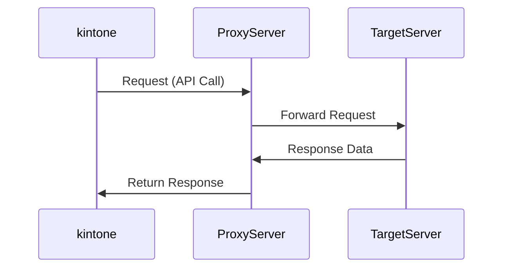

# kintone API 概要說明

kintone Consulting Service

日商才望子股份有限公司 

---
src: ./pages/intro.md
---

---

## kintone JavaScript API（事件）

事件

```js
kintone.events.on('app.record.index.show', (event) => {
  // 要做的事情 ...
})
```

就像是…

```js 
button.addEventListener('click', () => {
  // 要做的事情 ...  
})
```

<style>
code {
  font-size: 20px;
}
</style>

---

## 較常使用的 kintone JavaScript API

kinrone JavaScript API(事件)

- 🛠 **app.record.index.show** 紀錄列表頁面
- 🛠 **app.record.detail.show** 紀錄詳細頁面
- 🛠 **app.record.create.show** 紀錄添加頁面
- 🛠 **app.record.create.change.<欄位代碼>**
- 🛠 **app.record.create.submit** 紀錄新增按鈕觸發


<div class="abs-br m-6 text-xl">
  <a href="https://cybozu.dev/zh-tw/id/9744d83c79ac1b73e5cab2c7/#記錄清單畫面" target="_blank" class="slidev-icon-btn">
    <carbon:link />
  </a>
</div>

<style>
code {
  font-size: 20px;
}
</style>

---

## 事件的 event

```js
kintone.events.on('app.record.index.show', (event) => {
  console.log(event)
})
```

<v-click>
```js
{
  "type": "app.record.index.show",
  "appId": 193,
  "viewType": "list",
  "viewId": 20,
  "viewName": "（全部）",
  "records": [],
  "offset": 0,
  "size": 4,
  "date": null
}
```
</v-click>

<style>
code {
  font-size: 20px;
}
</style>


---

## 較常使用的 kintone JavaScript API

kinrone JavaScript API(方法)

- 🛠 **kintone.app.record.getId** - 取得紀錄 id
- 🛠 **kintone.app.getId** - 取得 app id
- 🛠 **kintone.app.record.get** - 取得當前紀錄
- 🛠 **kintone.app.record.set** - 設定當前紀錄
- 🛠 **kintone.getLoginUser** - 取得登入者資料
- 🛠 **kintone.app.getHeaderSpaceElement** - 取得 header 的 DOM

<v-click>

```js
// 範例 ...
const APP_ID = kintone.app.getId()
const RECORD_ID = kintone.app.record.get()
```

</v-click>

<div class="abs-br m-6 text-xl">
  <a href="https://cybozu.dev/zh-tw/id/9744d83c79ac1b73e5cab2c7/#get-set" target="_blank" class="slidev-icon-btn">
    <carbon:link />
  </a>
</div>

<style>
code {
  font-size: 20px;
}
</style>

---

## 範例：新增一個按鈕

```js
kintone.events.on('app.record.index.show', () => {
  // 取得 DOM
  const el = kintone.app.getHeaderMenuSpaceElement()
  // 建立 button 並 append
  const button = document.createElement('button')
  button.textContent = '按鈕'
  el.appendChild(button)
})
```

<v-click>


</v-click>

<style>
code {
  font-size: 18px;
}
</style>

---

## kintone REST API

分以下幾種

* 應用程式
* 記錄
* 空間
* 檔案
* 外掛程式
* API資訊

<div class="abs-br m-6 text-xl">
  <a href="https://cybozu.dev/zh-tw/kintone/docs/rest-api/" target="_blank" class="slidev-icon-btn">
    <carbon:link />
  </a>
</div>

---

## kintone REST API 範例

|  |  |  |
| -------- | -------- | -------- |
| 「取得」單個記錄     | `GET`     | /k/v1/record.json     |
| 「新增」單條記錄     | `POST`     | /k/v1/record.json     |
| 「更新」單個記錄     | `PUT`     | /k/v1/record.json     |

```js
kintone.events.on('app.record.index.show', async () => {
  const response = await fetch('/k/v1/record.json?app=193&id=1', {
    headers: {
      'X-Cybozu-API-Token': 'Kgzg2TvnRvMLMve3ppd4abIKPKZoprADAKve04OI'
    }
  })
})
```

<style>
code {
  font-size: 18px;
}
</style>

---

## 調用 API 的權限

分為以下兩種：

```js
// 帳號密碼轉 base64
headers: {
  'X-Cybozu-Authorization': 'cXFxcWVzOjI0ZmRnZGZhYQ=='
}

// 應用程式中的 token
headers: {
  'X-Cybozu-API-Token': 'Kxw76467FlFgjDkQ4jZtpgPFGKcA7y6s5fNn0M0x'
}
```

<style>
code {
  font-size: 18px;
}
</style>

---

## kintone 外部串接（Proxy）

即跨域，使用 Proxy 避開 CORS



---

## kintone.proxy 語法 

使用 `kintone.proxy`，`response` 返回 `[body, status, headers]`

```js
try {
  const [body, status, headers] = await kintone.proxy(
    'https://api.example.com',
    'GET',
    {},
    {}
  );
  // success
  console.log(status, body, headers);
} catch (error) {
  // error
  console.log(error); // 顯示代理 API 的回應正文（字串）
}
```

<div class="abs-br m-6 text-xl">
  <a href="https://cybozu.dev/zh-tw/kintone/docs/js-api/proxy/kintone-proxy/" target="_blank" class="slidev-icon-btn">
    <carbon:link />
  </a>
</div>

<style>
code {
  font-size: 18px;
}
</style>

---

## kintone Plugin 製作

外掛與客製化不同的地方：

1. 外掛需要先打包成 zip 才能匯入
2. 能夠針對 APP 做設定（儲存資料）
3. 重復使用

---
layout: image-right
image: https://i.imgur.com/MDODKOP.png
backgroundSize: contain
---

## plugin 架構範例

不一定要是此架構，只要 `manifest.json` 指定檔案路徑即可。

---
layout: image-right
image: https://i.imgur.com/uds60ha.png
backgroundSize: contain
---

## manifest.json

* 在 `desktop`、`mobile`、`config` 指定 JS 和 CSS 路徑。

* `config` 代表外掛設定頁面的檔案。

---

## 打包 plugin

使用 [@kintone/plugin-packer](https://www.npmjs.com/package/@kintone/plugin-packer) 打包 plugin。

```shell
{
  "scripts": {
    "package": "kintone-plugin-packer --ppk private.ppk"
  }
}
```
<v-click>
參數：

* `--ppk`：指令打包後的 ppk 檔，若沒指定將會產生一個 ppk 檔案。
* `--out`：輸出的外掛檔名。
* `--watch`：監聽模式。
</v-click>

<style>
code {
  font-size: 20px;
}
</style>

---

## plugin 可操作的方法
　
* **`kintone.plugin.app.setConfig(config, successCallback)`** - 儲存外掛設定
* **`kintone.plugin.app.getConfig(pluginId)`** - 取得外掛設定
* **`kintone.plugin.app.setProxyConfig(url, method, headers, data, successCallback)`** - 儲存 Proxy 設定
* **`kintone.plugin.app.getProxyConfig(url, method)`** - 取得 Proxy 設定

<br><br><br>

<v-click>
⚠️ setConfig 只能在外掛設定頁面調用
</v-click>

---

## plugin 範例：設定欄位顏色流程
　
1. 讓使用者在「外掛設定頁面中」，選取要變更顏色的欄位。
2. 外掛儲存欄位、顏色等資訊。
3. 使用者回到 `index.detail` 畫面中。
4. 使用 `getCnofig()` 取得欄位名稱、顏色等資料。
5. 將顏色設定到欄位上。

運用此方法，不用將欄位名稱寫死在 JS，可讓使用者自由指定欄位名稱。

---

## js-sdk


<div class="abs-br m-6 text-xl">
  <a href="https://hackmd.io/_uploads/H1GQ1mR_0.png" target="_blank" class="slidev-icon-btn">
    <carbon:link />
  </a>
</div>

---

## 參考資料
　
* [Cybozu Developer Network](https://cybozu.dev/zh-tw/kintone/)
* [Cybozu Developer Network（CN）](https://cybozudev.kf5.com/hc/)
* [iT邦幫忙 Cybozu台灣](https://ithelp.ithome.com.tw/users/20170470/articles)
* [iThome 鐵人賽 | kintone 娛樂城](https://ithelp.ithome.com.tw/2024ironman/signup/team/336)
* [Qiita](https://qiita.com/search?q=kintone&sort=created)
* [js-sdk](https://github.com/kintone/js-sdk)

---

## 注意事項
.
1. 不能使用 ESModule（ex: Vite）

